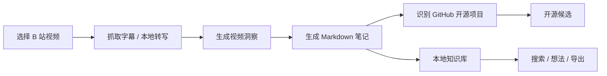
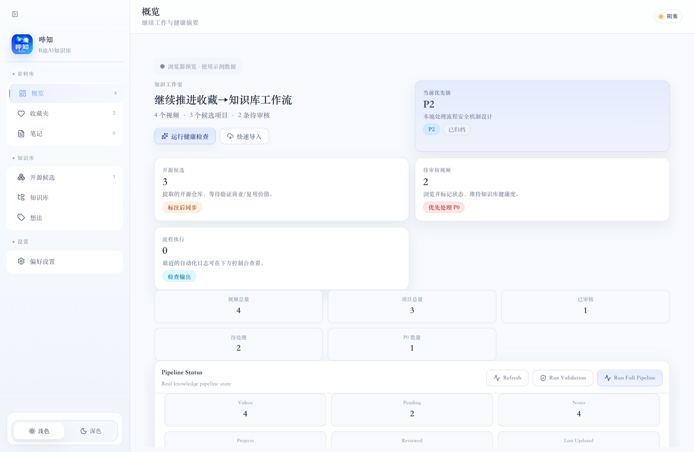
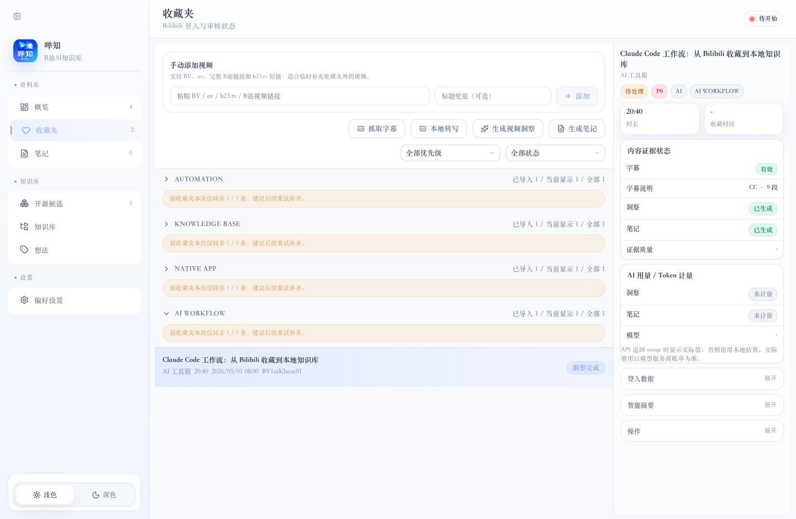
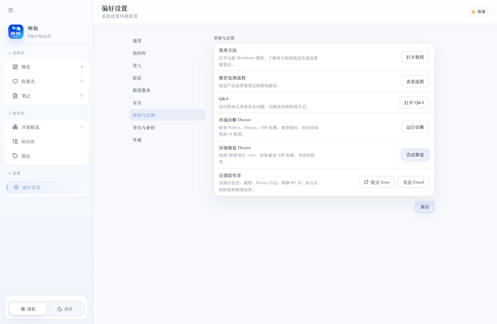

# 哔知 / BiZhi

<p align="center">
  <strong>把 B 站视频收藏，沉淀成可检索、可复用、可长期维护的本地 AI 知识库。</strong>
</p>

<p align="center">
  <a href="LICENSE"></a>
  <a href="docs/RELEASE.md"></a>
  
  
</p>

---

## 哔知解决什么问题？

我们经常在 B 站收藏 AI、编程、开源项目、产品设计类视频，但真正需要复用时，收藏夹通常只剩下一长串标题。视频入口被保存了，知识却没有沉淀下来。

哔知要解决的是：

- 收藏夹越来越长，但很难再次检索和复用；
- 视频里提到的工具、仓库、命令、方法论容易看过就忘；
- 只把标题丢给 AI 总结，结果往往空泛、像废话；
- 手动整理字幕、摘要、标签、Markdown 笔记太耗时；
- 用户需要一个本地优先、可导出、可审计的长期知识库。

哔知不是“自动总结全部收藏夹”的爬虫工具，而是一个**半自动视频知识工作台**：用户选择值得沉淀的视频，AI 负责字幕整理、洞察提取、笔记结构化和开源项目线索识别，最终由用户判断、标注、取舍和复用。

---

## 核心流程



推荐用法很克制：每天精选 5–10 条真正值得留下的视频，优先处理 15 秒到 30 分钟内容，一次处理一条，确认字幕质量后再生成洞察和笔记。


---

## 软件截图

以下截图来自哔知真实前端界面，使用浏览器预览模式下的脱敏示例数据，不包含 Cookie、API Key、私人字幕或真实笔记内容。

### 概览工作台



### 收藏夹与单条处理链路



### Doctor 与帮助反馈



## 已实现功能

| 模块 | 功能 |
|---|---|
| 收藏夹 | 同步 B 站收藏夹，支持手动添加 BV / av / b23.tv / 视频链接 |
| 字幕 | 优先抓取 B 站原生/AI 字幕，缺失时可本地 ASR 转写 |
| 洞察 | 基于字幕生成摘要、核心观点、适用场景、风险和判断依据 |
| 笔记 | 生成本地 Markdown 笔记，支持复制、编辑和导出 |
| 开源候选 | 从字幕/笔记中识别 GitHub 仓库，沉淀为高价值候选项目 |
| 想法 | 用户可写入真实判断、后续动作和 tags，而不是只看 AI 输出 |
| Token 计量 | 按视频记录洞察/笔记/项目匹配的模型用量，避免费用失控 |
| Doctor | 检查 Python、ffmpeg、yt-dlp、ASR、模型缓存、AI 配置和知识库结构 |
| Chrome Companion | MV3 浏览器助手，用于获取当前视频、登录态、Cookie 和页面元数据 |
| 本地知识库 | Markdown + JSON 文件结构，便于备份、审计、迁移和二次开发 |

---

## 脱敏真实使用状态

以下数据来自作者本机 Beta RC 日常验证，已去除 Cookie、API Key、原始字幕、私人笔记和收藏夹明细，仅保留规模与结果，用于说明项目不是纯 Demo：

| 项目 | 当前状态 |
|---|---:|
| 本地视频清单规模 | 6,000+ 条 |
| 已稳定验证的视频时长 | 15 秒 – 30 分钟 |
| 推荐每日生成笔记 | 5–10 条 |
| 本地生成笔记样本 | 8+ 条 |
| 已识别开源候选样本 | 3+ 个 |
| GitHub Actions CI | 通过 |
| GitHub Actions 全平台打包 | macOS x64 / macOS arm64 / Windows x64 / Linux x64 通过 |

这些数字不是性能承诺。哔知的目标不是批量吞掉全部收藏夹，而是帮助用户把真正值得留下的视频整理成知识资产。

---

## 仓库目录结构

```text
.
├── BiliKnowledge/                 # 本地知识库与 Python 处理脚本
│   ├── config/                    # 本地配置；真实配置被 Git 忽略
│   ├── manifest/                  # 视频清单、洞察、字幕索引、Token 用量等运行数据
│   ├── notes/                     # Markdown 笔记模板与本地生成笔记
│   ├── projects/                  # 从笔记中提取的开源项目候选
│   ├── reports/                   # 本地验证报告
│   ├── scripts/                   # 字幕、ASR、洞察、笔记、Doctor、校验脚本
│   └── thoughts/                  # 用户想法和产品/业务沉淀
│
├── BiliKnowledgeApp/              # Tauri 桌面端
│   ├── src/                       # React 前端页面和组件
│   └── src-tauri/                 # Rust/Tauri 后端命令、配置和打包资源
│
├── BiliKnowledgeCompanion/        # Chrome MV3 浏览器助手原型
│   ├── manifest.json
│   ├── background.js
│   ├── content.js
│   └── popup.*
│
├── docs/                          # 发布、开源、研究和使用文档
├── reports/                       # RC 验证与封板记录
├── tools/                         # 脱敏和敏感信息扫描工具
├── .github/workflows/             # CI 与 Release 自动打包 workflow
├── README.md
├── LICENSE
├── PRIVACY.md
├── SECURITY.md
└── DISCLAIMER.md
```

> 注意：真实收藏夹、Cookie、API Key、字幕、Token 账单、生成笔记、模型缓存和本地配置默认不提交到 Git。

---

## 安装包与当前发布状态

当前发布方式：GitHub Actions 根据 tag 自动生成 Draft Release。维护者需要人工检查草稿后再公开发布。

已验证打包目标：

- macOS x64：`.dmg` / `.app.tar.gz`
- macOS arm64：`.dmg` / `.app.tar.gz`
- Windows x64：NSIS `.exe`
- Linux x64：`.AppImage` / `.deb` / `.rpm`

> 当前 Beta RC 安装包未配置正式代码签名/公证，适合内测和源码用户。公开分发前应补齐 macOS Developer ID、Notarization 和 Windows Code Signing。

---

## 快速开始：本地开发

```bash
git clone https://github.com/1lvinx/BiliKnowledgeMVP.git
cd BiliKnowledgeMVP
cd BiliKnowledgeApp
npm install
npm run tauri dev
```

桌面端通过 Tauri 读取本地真实数据。纯浏览器预览只适合看 UI，不代表完整处理链路。

---

## 本地依赖

基础开发依赖：

- Node.js 22+
- Rust stable toolchain
- Python 3.9+

完整处理链路建议安装：

- ffmpeg
- yt-dlp
- Python virtualenv
- FunASR / ModelScope / PyTorch 本地 ASR 栈
- 可用的 AI Provider 或 OpenAI-compatible 本地/云端接口

常用环境变量：

```bash
export BILIKNOWLEDGE_ROOT=/absolute/path/to/BiliKnowledge
export BILIKNOWLEDGE_PYTHON=/absolute/path/to/python3
```

运行 Doctor：

```bash
python3 BiliKnowledge/scripts/doctor.py --root BiliKnowledge
```

---

## 验证命令

```bash
cd BiliKnowledgeApp && npm run build
cd BiliKnowledgeApp && npm audit --audit-level=moderate
cd BiliKnowledgeApp/src-tauri && cargo test
cd ../..
python3 BiliKnowledge/scripts/test_validate_knowledge_base.py
python3 BiliKnowledge/scripts/test_update_processing_status.py
python3 BiliKnowledge/scripts/validate_knowledge_base.py --root BiliKnowledge
python3 -m compileall -q BiliKnowledge/scripts
python3 tools/scan_sensitive.py
```

---

## 隐私、安全与合规边界

哔知是本地优先工具，但它可能处理敏感数据：B 站 Cookie、AI API Key、字幕、私人笔记、Token 用量和本地路径。提交 Issue、截图或日志前，请先检查并脱敏。

哔知仅用于个人知识整理，不提供绕过平台限制的能力，不建议批量抓取或高并发处理。用户需要自行遵守 B 站规则、版权要求、AI 服务商条款和所在地法律。

更多说明：

- [PRIVACY.md](PRIVACY.md)
- [SECURITY.md](SECURITY.md)
- [DISCLAIMER.md](DISCLAIMER.md)

---

## 开源声明与联系作者

哔知是作者利用工作之余持续打磨的个人业务开发小工具，最初目的是解决自己日常 B 站视频收藏、字幕整理、AI 笔记和知识库沉淀的问题。项目目前仍处于 Beta RC 阶段，功能、安装体验和跨平台兼容性都还在持续改进中。

如果这个项目对你有帮助，欢迎 Star、试用、提 Issue 或提交 PR；如果遇到问题，也欢迎通过 GitHub Issue、公众号或邮件反馈。由于这是个人闲余时间维护的开源项目，响应速度可能无法像商业团队一样稳定，还请理性交流，不喜勿喷。

- GitHub Issue：[提交问题或建议](https://github.com/1lvinx/BiliKnowledgeMVP/issues)
- Email：[yolandear@gmail.com](mailto:yolandear@gmail.com)
- 公众号：逸峰AI
- 微信：扫码添加作者，请备注「哔知」

<table>
  <tr>
    <td align="center">
      
      <br />
      <strong>公众号：逸峰AI</strong>
    </td>
    <td align="center">
      
      <br />
      <strong>作者微信</strong>
    </td>
  </tr>
</table>

## Roadmap

- 稳定 Doctor 一键诊断与修复；
- 改进首次使用引导；
- 引入更成熟的 Browser Bridge / Cookie 刷新机制；
- 强化字幕质量校验和 ASR 失败解释；
- 优化 GitHub 项目精准匹配与候选入库；
- 完善 Token 费用估算和多模型配置；
- 补齐签名、公证和正式公开发布流程。

---

## 贡献

欢迎提交 Issue 和 PR，但请保持产品边界：哔知不是爬虫平台，不追求全自动批量总结，而是服务于用户主动筛选、少量高价值沉淀的本地知识工作流。

请先阅读 [CONTRIBUTING.md](CONTRIBUTING.md)。如果需要私下反馈安全、隐私或安装问题，可以发送邮件至 [yolandear@gmail.com](mailto:yolandear@gmail.com)。

---

## License

本项目采用 [MIT License](LICENSE)。

Copyright (c) 2026 逸峰AI / Elvin
