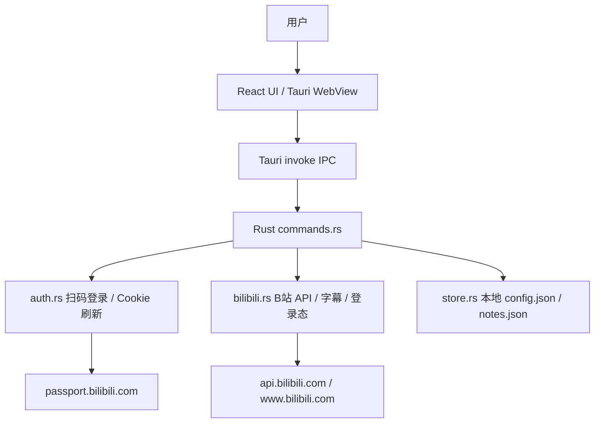
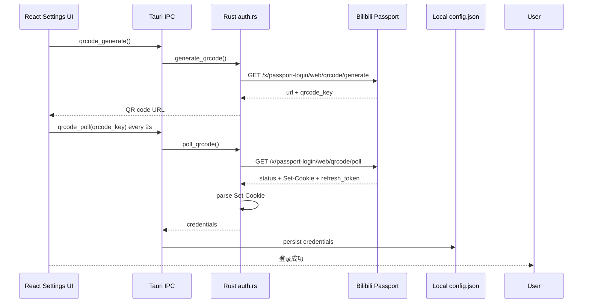
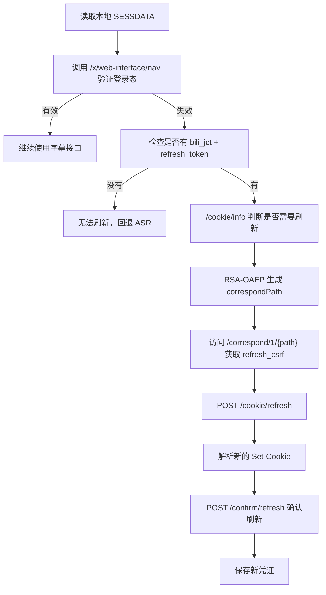
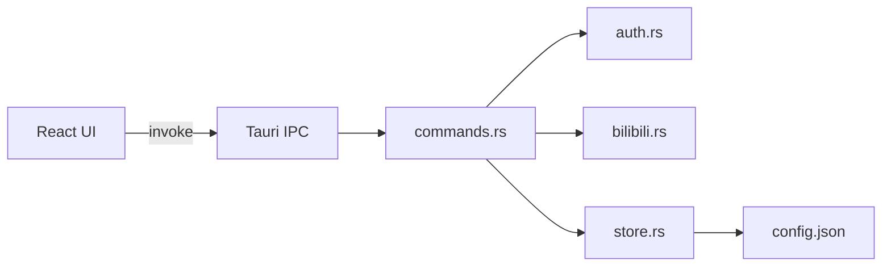
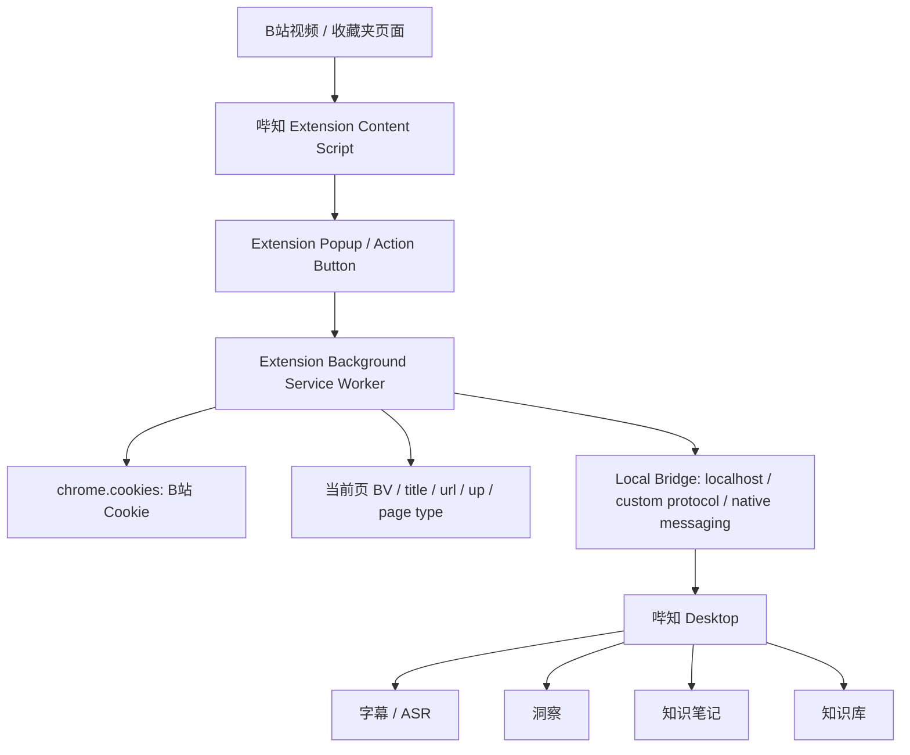

# BiliNote Browser / Cookie / Communication Research

> 研究对象：<https://github.com/yyyzl/bilinote>  
> 研究日期：2026-06-29  
> 研究范围：Browser Extension、Cookie 获取、浏览器/桌面通信。  
> 明确排除：AI pipeline、笔记生成、Prompt、RAG、产品逻辑迁移。

---

## 0. Executive Summary

本次研究的关键结论：

**BiliNote 当前仓库主线没有发现独立 Browser Extension / Chrome Extension 实现。**

仓库主体是一个 **Tauri 2 + Rust + React** 的本地应用，B 站登录与 Cookie 管理由 Tauri 后端完成，主要通过：

- B 站扫码登录；
- 从 `Set-Cookie` 解析登录凭证；
- 本地保存 `SESSDATA / bili_jct / refresh_token / DedeUserID`；
- 使用 B 站 Cookie 刷新接口自动续期；
- 前端通过 Tauri IPC 调用后端命令。

因此，BiliNote **不能直接作为哔知的 Browser Bridge 复用**。它没有提供浏览器扩展、`chrome.cookies`、content script、native messaging 或浏览器页面动作桥接。

但它的 **桌面端扫码登录 + Cookie 自动刷新设计** 很成熟，值得哔知参考。

最终建议：

```text
Option C：Reference architecture and reimplement
```

即：

- 不直接复用 BiliNote 源码；
- 不迁移它的 AI / Note / Pipeline；
- 参考它的 Cookie 生命周期设计；
- 哔知自己实现一个轻量 Browser Bridge；
- 桌面端保留现有 AI 处理与知识库沉淀逻辑。

---

## 1. Browser Extension

### 1.1 是否存在扩展目录

在仓库中检查以下常见目录与文件：

```text
extension/
browser-extension/
chrome/
manifest.json
background.js / background.ts
content.js / content.ts
popup.html / popup.tsx
```

本次检索未发现独立浏览器扩展实现。

仓库主要结构为：

```text
binote/
├── src/                 # React 前端
├── src-tauri/           # Rust / Tauri 后端
├── package.json
├── vite.config.ts
└── src-tauri/src/
    ├── auth.rs          # B站扫码登录与 Cookie 刷新
    ├── bilibili.rs      # B站 API、字幕、登录态验证
    ├── commands.rs      # Tauri commands
    ├── store.rs         # config / notes 本地持久化
    └── lib.rs           # Tauri command 注册
```

### 1.2 MV2 / MV3

不适用。

没有发现 `manifest.json`，因此不存在 Chrome Extension Manifest V2 或 V3 的判断对象。

| 项目 | 结论 |
|---|---|
| MV2 | 未发现 |
| MV3 | 未发现 |
| chrome extension manifest | 未发现 |
| browser extension source | 未发现 |

### 1.3 Permission List

不适用。

因为没有浏览器扩展 manifest，所以没有：

- `cookies`
- `tabs`
- `activeTab`
- `storage`
- `nativeMessaging`
- `host_permissions`
- `scripting`

等浏览器扩展权限声明。

### 1.4 Background / Content Script / Popup

不适用。

未发现：

- background service worker；
- background page；
- content script；
- popup UI；
- options page；
- extension-side message passing。

### 1.5 实际架构

BiliNote 的实际架构是：



这不是 Browser Bridge，而是 Desktop App 直接访问 B 站接口。

---

## 2. Cookie Retrieval

### 2.1 Cookie 获取方式

BiliNote 的 Cookie 获取方式主要有两条：

```text
A. 扫码登录自动获取
B. 手动输入 SESSDATA
```

核心文件：

```text
binote/src-tauri/src/auth.rs
binote/src-tauri/src/commands.rs
binote/src-tauri/src/store.rs
binote/src-tauri/src/bilibili.rs
binote/src/pages/Settings.tsx
binote/src/lib/tauri.ts
```

### 2.2 是否使用 chrome.cookies API

没有。

因为没有浏览器扩展，所以没有使用：

```ts
chrome.cookies.get(...)
chrome.cookies.getAll(...)
browser.cookies.get(...)
```

### 2.3 是否使用 document.cookie

没有发现浏览器页面侧 `document.cookie` 获取 B 站 Cookie 的实现。

原因也很合理：

- Tauri App 内部 WebView 并不等于用户真实浏览器；
- B 站 Cookie 属于 `bilibili.com` 域；
- 普通网页脚本无法读取跨域 Cookie；
- HttpOnly Cookie 也不能通过 `document.cookie` 获取。

### 2.4 是否使用 Native Messaging

没有。

未发现 Chrome Native Messaging Host 配置或调用。

### 2.5 Cookie 获取流程：扫码登录

BiliNote 后端流程如下：



相关命令：

```rust
qrcode_generate
qrcode_poll
get_login_status
logout_bilibili
verify_sessdata
```

位置：

```text
binote/src-tauri/src/commands.rs
binote/src-tauri/src/auth.rs
binote/src/lib/tauri.ts
binote/src/pages/Settings.tsx
```

### 2.6 Cookie 自动刷新流程

BiliNote 实现了较完整的 Cookie refresh 生命周期：



核心位置：

```text
binote/src-tauri/src/auth.rs
```

### 2.7 使用的 Cookie / 凭证清单

| 名称 | 来源 | 用途 | 备注 |
|---|---|---|---|
| `SESSDATA` | 扫码登录 Set-Cookie / 手动输入 | 判断登录态、请求字幕接口 | 最核心 Cookie |
| `bili_jct` | 扫码登录 Set-Cookie | CSRF token；Cookie 刷新接口需要 | 自动刷新必需 |
| `DedeUserID` | 扫码登录 Set-Cookie | 用户 ID 标识 | 主要用于记录登录账号 |
| `refresh_token` | 扫码轮询返回数据 / 刷新接口返回 | 自动刷新 Cookie | 不是普通 Cookie，但属于敏感凭证 |
| `bilibili_cookie_ts` | 本地生成 | 记录凭证保存时间 | 用于状态展示或生命周期判断 |

本地配置结构见：

```text
binote/src-tauri/src/store.rs
binote/src/lib/tauri.ts
```

---

## 3. Browser / Desktop Communication

### 3.1 是否有浏览器到桌面的通信

没有发现独立浏览器扩展，因此没有：

- Browser Extension → Desktop；
- Native Messaging；
- localhost HTTP bridge；
- WebSocket bridge；
- clipboard bridge；
- file bridge。

### 3.2 实际通信方式：Tauri IPC

BiliNote 前端和后端通信方式是 Tauri IPC：

```ts
invoke("qrcode_generate")
invoke("qrcode_poll")
invoke("get_login_status")
invoke("verify_sessdata")
invoke("logout_bilibili")
```

位置：

```text
binote/src/lib/tauri.ts
```

后端注册位置：

```text
binote/src-tauri/src/lib.rs
```

### 3.3 数据流



### 3.4 对哔知的意义

BiliNote 没有解决“真实浏览器登录态传给桌面”的问题。

它解决的是：

```text
桌面应用自己发起 B站扫码登录，并维护自己的 Cookie 生命周期。
```

这对哔知很有参考价值，但不是 Browser Bridge。

---

## 4. Current Page Detection

### 4.1 扩展侧当前页面检测

未发现浏览器扩展，因此没有 content script 检测当前页面。

没有发现如下逻辑：

- 当前 tab URL；
- 当前 B 站视频页 BV 号；
- 当前收藏夹页面；
- 当前合集 / 合集列表；
- 从 DOM 读取标题、UP 主、收藏夹信息；
- content script 向后台发送 metadata。

### 4.2 BiliNote 的视频识别方式

BiliNote 通过用户输入链接或分享链接，然后后端解析：

- `b23.tv` 短链；
- `BVxxx`；
- `av123456`；
- 完整 B 站 URL；
- B 站 App 复制出来的“标题 + 链接”文本。

README 中也明确描述了这一点。

相关文件：

```text
binote/src-tauri/src/commands.rs
binote/src-tauri/src/bilibili.rs
binote/src/pages/Dashboard.tsx
```

### 4.3 对哔知的启发

如果哔知要做 Browser Bridge，应自己实现：

```text
Chrome Extension content script
↓
识别当前页面类型
↓
提取 BV / title / UP / URL / favorite context
↓
用户点击“发送到哔知”
↓
通过 localhost / custom protocol / native messaging 发给 Desktop
```

---

## 5. Login State

### 5.1 登录检测

BiliNote 使用：

```text
GET https://api.bilibili.com/x/web-interface/nav
Cookie: SESSDATA=...
```

返回 `is_login` 判断是否登录。

位置：

```text
binote/src-tauri/src/bilibili.rs
```

### 5.2 Cookie 过期处理

如果登录态无效：

1. 检查本地是否保存 `bili_jct` 与 `refresh_token`；
2. 如果存在，则调用自动刷新流程；
3. 刷新成功后保存新凭证；
4. 再次验证登录态；
5. 如果刷新失败，回退到 ASR 或提示重新登录。

位置：

```text
binote/src-tauri/src/commands.rs
binote/src-tauri/src/auth.rs
```

### 5.3 匿名模式

BiliNote 支持未登录使用，但字幕能力受限：

- 未登录时不请求需要登录的字幕；
- 字幕不可用时回退 ASR；
- 手动输入 `SESSDATA` 时不支持自动刷新；
- 扫码登录时支持自动刷新。

### 5.4 Cookie refresh 成熟度

这一部分是 BiliNote 对哔知最有价值的地方。

哔知当前如果仍主要依赖手动 Cookie 或单次扫码登录，可以参考 BiliNote 的：

- `SESSDATA` 登录态验证；
- `bili_jct` 保存；
- `refresh_token` 保存；
- Cookie refresh 检查；
- RSA-OAEP `correspondPath` 生成；
- refresh_csrf 提取；
- refresh 确认流程；
- 过期后安全回退。

---

## 6. Security Evaluation

### 6.1 Cookie 存储

BiliNote 将凭证保存在 Tauri app data 目录下的 `config.json`。

README 中描述路径：

```text
Windows: %APPDATA%/com.binote.app/config.json
macOS: ~/Library/Application Support/com.binote.app/config.json
Android: /data/data/com.binote.app/files/config.json
```

配置字段包括：

```text
bilibili_sessdata
bilibili_bili_jct
bilibili_refresh_token
bilibili_dede_user_id
bilibili_cookie_ts
```

### 6.2 加密情况

未发现对本地 `config.json` 中 Cookie / Token 的加密存储。

风险：

- 本机恶意程序可读取配置文件；
- 用户误提交配置文件可能泄露登录态；
- refresh_token 泄露后风险高于单次 SESSDATA；
- 日志或错误报告必须避免打印敏感值。

### 6.3 Browser Extension 安全风险

由于没有扩展实现，BiliNote 没有暴露以下扩展风险：

- `chrome.cookies` 权限过大；
- content script 注入风险；
- native messaging host 被滥用；
- localhost API 被任意网页调用；
- 扩展与桌面鉴权不足。

但如果哔知未来做 Browser Bridge，需要重点处理这些风险。

### 6.4 对哔知的安全建议

如果哔知实现 Browser Bridge，建议：

1. **扩展只读取 B 站域名 Cookie**  
   不申请过宽 host 权限。

2. **桌面端不长期保存完整 Cookie，除非用户明确授权**  
   可提供“临时会话 / 记住登录”选项。

3. **Local Bridge 必须鉴权**  
   不建议裸开 `localhost:port` 接收任意网页请求。

4. **只允许扩展 origin 调用**  
   如果使用 HTTP/WebSocket，本地服务应校验一次性 token。

5. **敏感字段永不进入日志**  
   包括 `SESSDATA`、`bili_jct`、`refresh_token`。

6. **Doctor 检测敏感泄露**  
   哔知已有敏感数据扫描思路，应继续强化。

---

## 7. License

### 7.1 仓库声明

README badge 显示：

```text
license: MIT
```

但本次本地检索未在仓库根目录或 `binote/` 目录发现标准 `LICENSE` 文件。

这意味着需要谨慎处理：

- README badge 表示作者意图可能是 MIT；
- 但没有 LICENSE 正文时，法律上复用边界不如标准 MIT 仓库清晰；
- 直接复制代码前应确认仓库是否后续补充 LICENSE，或联系作者确认。

### 7.2 是否可以复用浏览器扩展代码

不适用。

因为未发现浏览器扩展代码。

### 7.3 是否可以复用 Cookie 代码

从产品和工程角度：可以参考设计，但不建议直接复制。

原因：

1. 当前仓库缺少标准 LICENSE 文件；
2. 哔知已有自己的 Tauri/Rust/Python 架构；
3. 直接复制会引入维护责任和隐性耦合；
4. Cookie refresh 属于敏感能力，最好由哔知按自身安全模型重写；
5. BiliNote 的实现是桌面扫码登录，不是 Browser Bridge。

建议：

```text
参考机制，不复制源码。
```

如果未来确认 MIT LICENSE 完整存在，也应保留 attribution。

---

## 8. Pros / Cons / Risks

### 8.1 Pros

BiliNote 值得学习的点：

1. **扫码登录链路完整**  
   不依赖用户手动复制 Cookie。

2. **Cookie 自动刷新机制成熟**  
   包含 `cookie/info`、RSA-OAEP、`refresh_csrf`、`cookie/refresh`、`confirm/refresh`。

3. **登录态验证清楚**  
   使用 `/x/web-interface/nav` 判断 `is_login`。

4. **手动 SESSDATA 兜底**  
   高级用户仍可手动输入。

5. **字幕优先、失败回退**  
   登录不可用时能降级。

6. **Tauri IPC 边界清晰**  
   前端只通过 commands 操作敏感能力。

### 8.2 Cons

1. **没有 Browser Extension**  
   不能直接解决哔知想要的浏览器侧动作桥接。

2. **没有当前页面检测**  
   不能直接识别用户正在看的 B 站视频页面。

3. **没有 chrome.cookies 模块**  
   无法作为 Cookie Bridge 直接复用。

4. **Cookie 明文落盘**  
   对哔知公开分发来说需要更谨慎。

5. **缺少标准 LICENSE 文件**  
   直接复制源码存在许可不确定性。

### 8.3 Risks

| 风险 | 影响 | 对哔知建议 |
|---|---|---|
| B 站接口变化 | 登录、刷新、字幕失效 | Doctor 检测 + 降级方案 |
| Cookie 泄露 | 用户账号风险 | 加密存储 / 不打日志 / 明确授权 |
| 过度抓取 | 风控、账号限制 | 不做批量扩展抓取；用户触发为主 |
| Local bridge 被滥用 | 任意网页向桌面发指令 | 本地鉴权 token + origin 校验 |
| License 不完整 | 复用争议 | 参考设计，重写实现 |

---

## 9. Recommended Browser Bridge for 哔知

哔知的产品哲学是：

```text
Browser
↓
Select Video
↓
Desktop
↓
Subtitle
↓
Insight
↓
Knowledge Card
↓
Knowledge Base
```

浏览器应该只提供：

- 登录状态；
- Cookie；
- 当前页面 metadata；
- 用户触发动作。

AI 处理仍保留在 Desktop。

基于本次研究，建议哔知采用以下方案。

### 9.1 Browser Bridge 架构



### 9.2 Extension 只做轻任务

Extension 不应该做：

- AI 总结；
- Prompt；
- RAG；
- 笔记生成；
- 批量收藏夹爬取；
- 大规模后台任务。

Extension 只做：

```text
读取当前页 → 读取必要 Cookie → 用户点击发送 → 交给 Desktop
```

### 9.3 桌面端仍需扫码登录

即使未来做 Browser Bridge，也建议保留桌面扫码登录。

原因：

- 没装扩展的用户仍可使用；
- 扩展失效时有兜底；
- 移动端 / 其他浏览器场景可复用；
- Cookie refresh 更适合由桌面端维护。

因此哔知可以形成双入口：

```text
A. 桌面扫码登录：稳定基础能力
B. Browser Bridge：更顺手的当前页导入能力
```

---

## 10. Final Recommendation

### Option A：Reuse extension directly

不建议。

原因：BiliNote 没有发现浏览器扩展实现。

### Option B：Reuse only cookie module

不建议直接复用源码。

原因：

- Cookie 模块是 Rust/Tauri 桌面登录，不是浏览器模块；
- LICENSE 文件缺失，直接复制不稳；
- 哔知应按自身安全模型重写；
- 可以参考流程，但不搬代码。

### Option C：Reference architecture and reimplement

**推荐。**

具体建议：

1. 参考 BiliNote 的扫码登录和 Cookie refresh 生命周期；
2. 哔知独立实现桌面端 Cookie 管理；
3. 哔知独立设计 Chrome MV3 Browser Bridge；
4. Browser Bridge 只负责当前页 metadata、Cookie 和用户触发动作；
5. AI pipeline、笔记、知识库全部留在哔知 Desktop；
6. 加入 Doctor 检测 Cookie / 登录 / B站接口状态；
7. 对 Cookie 明文存储、日志、导出报告做严格限制。

### Option D：Do not reuse

不完全建议。

虽然不能直接复用扩展，但 BiliNote 的 Cookie 自动刷新设计非常有参考价值。

最终选择：

```text
Option C：Reference architecture and reimplement
```

一句话总结：

> BiliNote 不是哔知要找的 Browser Bridge，但它提供了一个值得参考的桌面端 B站登录与 Cookie 生命周期样板。哔知应吸收其登录/续期思路，重新实现自己的轻量浏览器桥接层。
